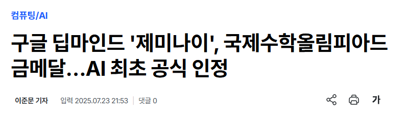
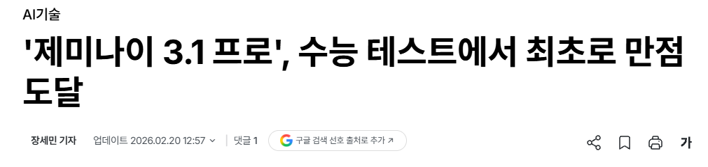
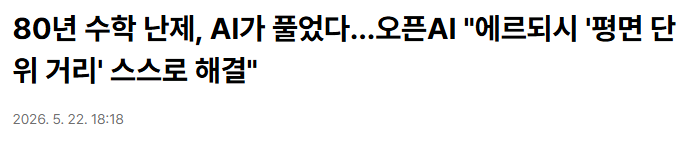
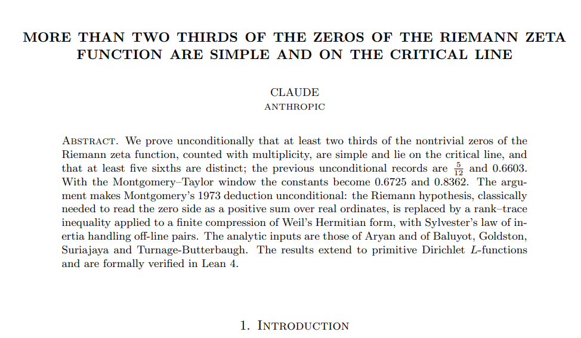

<!--
Part 0 인트로 슬라이드 초안 (#0.1~0.4, 7분)

- 사용자가 직접 다듬은 Introduction 2장(IQ 150+ 후배 프레임)을 최대한 그대로 반영.
  구성: 타이틀 → Introduction ①(능가했을지 모른다 + 이정표 + 후배 은유)
  → Introduction ②(나은 점/맡기는 법 → 기능 매핑) → 오늘의 여정.
- 기사 캡처·논문 이미지: slides/assets/intro/ (원본 PPTX에서 추출·보관).
- 사실관계는 docs/01-intro-facts.md 참고, 발표 직전 최신화.
- 번호는 Part 1(#4~15)과의 충돌을 피해 #0.x를 임시 사용, 최종 렌더 시 통합.
-->

<!-- _class: title -->
<!-- _paginate: false -->

# 클로드를 더 잘 활용하는 법

## 채팅에서 에이전트까지

DSP&AI Lab., Yonsei University
발표자 · 날짜

<!--
#0.1 | 30초
- 제목이 곧 주제: "어떻게 하면 클로드를 더 잘 활용할까?"
- 부제가 방법론: 발전 과정을 따라가며 배운다.
-->

---

# Introduction






**AI의 지능은 이미 우리를 능가했을지 모른다**

- 국제수학올림피아드(IMO) 금메달 – 25.07
- 수능 만점 – 26.02
- 최초의 수학 증명 – 26.05
- 리만가설 진전 – 26.08
  <span class="cite">anthropic.com/research/riemann-zeta</span>

**개인적인 AI를 사용할 때의 생각**

- AI를 **IQ 150+의 후배**로 생각하자
- 똑똑한 후배보다 내가 아직 나은 점이 무엇일까?
- 후배에게 어떻게, 어디까지 일을 맡겨야 하는가?

*< AI의 업적을 소개한 기사 · 클로드의 리만가설 논문 >*

<!--
#0.2 | 3분 | Introduction ① (사용자 직접 구성 버전 기반)
- 오른쪽: 실제 기사 캡처 3장 + 리만 논문 1페이지 (slides/assets/intro/).
- 이정표는 캡처와 1:1 대응: IMO 금메달(제미나이, 25.07 공식 인정),
  수능 만점(제미나이 3.1 프로, 26.02), 최초의 수학 증명(오픈AI 에르되시
  평면 단위 거리, 26.05), 리만가설 진전(클로드 논문, 26.08).
- ⚠️ 발표 직전 확인: 26.05 "최초의 수학 증명" 표현과 26.08 리만 논문 상태
  (docs/01-intro-facts.md의 야코비안/CDC 검증 항목과 함께 최신화).
- "IQ 150+ 후배" 은유가 이 발표 전체의 프레임: 뒤의 모든 기능이
  "후배에게 일을 잘 맡기는 방법"으로 읽히게 된다.
-->

---

# Introduction

**똑똑한 후배보다 내가 아직 나은 점**

- 도메인 지식, 노하우

**후배에게 어떻게, 어디까지 일을 시킬까**

- 프로그램 사용법 교육, 서버 할당, 권한 제한, 업무의 검증

**많은 사람들의 같은 고민**

- AI에게 도메인 지식, 노하우를 주는 법 → **Instructions, memory, skills**
- 서버 할당, 권한 제한, 업무의 검증 → **Tools, MCP, permissions, harness**

<!--
#0.3 | 2분 | Introduction ② (사용자 직접 구성 버전 기반)
- 후배 은유를 실무 언어로 전개: 사람 후배에게 하는 일(교육/서버/권한/검증)이
  AI에게는 각각 어떤 메커니즘인지 매핑.
- 마지막 두 줄이 발표 전체의 지도: Instructions·memory·skills는 Part 1의
  Projects~지시의 계보로, Tools·MCP·harness는 Part 1 도구~Part 2 Claude Code로
  이어진다. "오늘 이 답들을 하나씩 보게 됩니다"로 전환.
-->

---

# 오늘의 여정

**답을 찾는 방법: 기능 목록이 아니라 발전 과정을 따라갑니다**

```
2023          2024                    2025~
 채팅   →   기능의 축적          →   에이전트 (Claude Code)
            "왜 이 기능이 나왔는가"를 알면, 언제 써야 하는지 보인다
```

- **Part 1** (40분) — 채팅에서 에이전트까지: 기능과 역량의 진화
- **Part 2** (50분) — 에이전트의 완성형: Claude Code + 라이브 데모
- 다루지 않는 것: API 연동 개발

<!--
#0.4 | 1.5분 | 지도
- Introduction ②의 기능 매핑(Instructions·skills / Tools·MCP·harness)이
  이 여정 위 어디에 있는지 가리키며 연결.
- 휴식 시간·Q&A 안내 한 줄. "여정의 끝에서 후배에게 일을 맡기는 각자의 방법이
  생기기를" 정도로 인트로 마감.
-->
