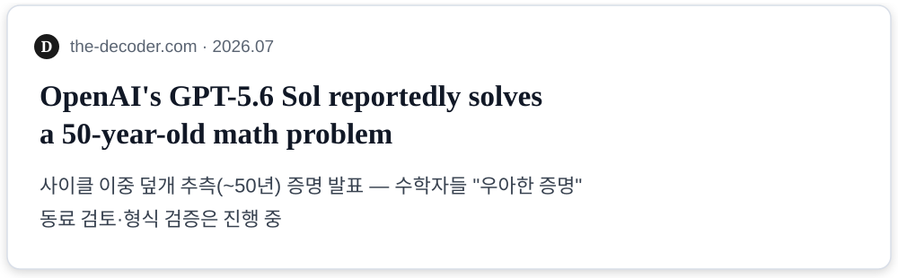

<!--
Part 0 인트로 슬라이드 초안 (#0.1~0.5, 7분)

- 인트로 아크: 훅(지능은 충분하다) → 긴장(왜 내 업무에선?) → 전환(활용의 문제)
  → 지도(오늘의 여정). 발표 전체 주제 "어떻게 하면 클로드를 더 잘 활용할까?"로 착지.
- 사실관계는 docs/01-intro-facts.md에 출처와 함께 정리 (2026-08-30 검증).
- 번호는 Part 1(#4~15)과의 충돌을 피해 #0.x를 임시 사용, 최종 렌더 시 통합.
-->

# 클로드를 더 잘 활용하는 법

## 채팅에서 에이전트까지

발표자 · 날짜

<!--
#0.1 | 30초
- 제목이 곧 주제: "어떻게 하면 클로드를 더 잘 활용할까?"
- 부제가 방법론: 발전 과정을 따라가며 배운다.
-->

---

# AI는 이미 수학의 난제를 풀기 시작했다 — 2026년 7월

<style scoped>
img { display: block; margin: 4px auto; }
p:last-of-type { text-align: center; font-size: 0.85em; color: #5A6472; }
</style>




그리고: IMO 금메달 수준 (2025) · 에르되시 미해결 문제들 해결 (2026.01, Tao 검증)

<!--
#0.2 | 2분 | 훅
- 실제 출처·헤드라인·날짜로 만든 인용 카드 2장 (assets/news-*.svg).
  실제 기사 스크린샷을 확보하면 같은 파일명으로 교체 가능 — assets/README.md 참고.
- 카드 1(야코비안): "87년 문제가 매듭지어졌다"를 먼저, 검증 완료(Lean)를 강조.
- 카드 2(GPT-5.6): 특정 회사 이야기가 아니라 시대의 이야기임을 보여주는 역할.
- 정확성 유지 (개발자 청중은 과장에 민감):
  · 야코비안: "AI 단독"이 아니라 수학자와 함께, "증명"이 아니라 반례로 반증,
    2차원 케이스는 여전히 미해결. 단, 반증도 87년 문제를 매듭지은 것.
  · GPT-5.6: "증명 발표 + 검토 진행 중"까지만. "해결 확정"이라고 말하지 않기.
- 마무리 멘트: "적어도 이런 영역에서, 지능은 이미 인간 최고 수준을 넘나듭니다."
  ("우리보다 높은 지능"이라는 단정 대신 — 근거가 지탱하는 선까지만)
-->

---

# 그런데, 왜 내 프로젝트에서는

**87년 난제를 푸는 AI가...**

- 우리 팀에 없는 라이브러리를 자신 있게 import 하고
- 팀 컨벤션을 무시한 코드를 내놓고
- 그럴듯한 오답을 확신에 차서 말할까?

**난제를 푸는 지능과 내 레포에서 헤매는 지능 — 같은 모델입니다.**

<!--
#0.3 | 1.5분 | 긴장
- 청중 전원이 겪어본 경험. 웃음 포인트이자 공감 포인트.
- 사내에서 실제로 회자된 실패담이 있으면 한 줄 교체 (일반화된 표현 유지).
- 질문을 던져놓고 다음 장에서 답한다.
-->

---

# 격차는 지능이 아니라 활용에 있다

같은 모델, 다른 결과. 차이를 만드는 것은:

- **무엇을 주는가** — 컨텍스트 (난제에는 완결된 문제 정의가 있었다)
- **어떻게 맡기는가** — 위임 방식 (명확한 목표, 검증 가능한 형태)
- **어떻게 확인하는가** — 검증 (반례는 하루 만에 기계 검증됐다)

# 오늘의 질문: **"어떻게 하면 클로드를 더 잘 활용할까?"**

<!--
#0.4 | 1.5분 | 전환 — 인트로의 핵심 장
- 훅의 사례를 그대로 재사용해 세 요소를 설명하는 것이 포인트:
  난제 해결의 이면에는 완결된 문제 정의(컨텍스트)와 즉시 검증(Lean)이 있었다.
  내 업무에서 아쉬운 결과의 이면에는 대부분 이 요소들의 부재가 있다.
- 이 세 요소(컨텍스트/위임/검증)가 Part 1 역량 축과 Part 3 "역량의 이동"의
  예고편이 된다 — 발표 마지막에 이 장을 다시 비추면 수미상관.
-->

---

# 오늘의 여정

**답을 찾는 방법: 기능 목록이 아니라 발전 과정을 따라갑니다**

```
2023          2024                    2025~
 채팅   →   기능의 축적          →   에이전트 (Claude Code)
            "왜 이 기능이 나왔는가"를 알면, 언제 써야 하는지 보인다
```

- **Part 1** (40분) — 채팅에서 에이전트까지: 기능과 역량의 진화
- **Part 2** (50분) — 에이전트의 완성형: Claude Code + 라이브 데모
- 다루지 않는 것: API 연동 개발

<!--
#0.5 | 1.5분 | 지도 (기존 "오늘의 스토리라인" 장을 흡수)
- 휴식 시간·Q&A 안내 한 줄.
- "여정의 끝에서 오늘의 질문에 대한 여러분의 답이 생기기를" 정도로 인트로 마감.
-->
