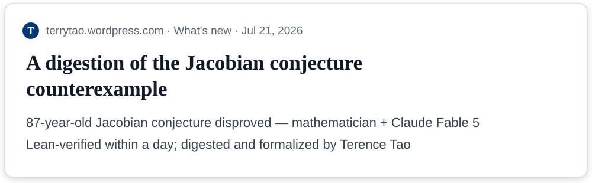
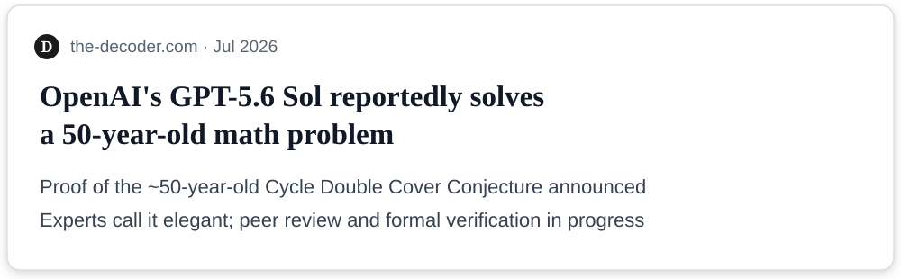

<!--
Part 0 intro slides — ENGLISH (final-deck language).
Copy follows the lab template's English style: concise noun-phrase titles,
declarative bullets, angle-bracket captions, citations in small type.
Korean draft (part0-draft.md) remains the planning/reference version.
Speaker notes stay in Korean for the presenter.
-->

<!-- _class: title -->
<!-- _paginate: false -->

# How to Get the Most out of Claude

## From Chat to Agents

DSP&AI Lab., Yonsei University
발표자 이름
2026.MM.DD

<!--
#0.1 | 30초
- 제목이 곧 주제(질문), 부제가 방법론(발전 과정을 따라간다).
- 템플릿 타이틀 형식: 제목 30pt #003876 / 소속 / 발표자 / 날짜.
-->

---

# AI Is Settling Open Problems in Math — July 2026

<style scoped>
img { display: block; margin: 4px auto; }
p:last-of-type { text-align: center; font-size: 0.85em; color: #5A6472; }
</style>





Also: IMO gold-medal standard (2025) · Open Erdős problems solved (Jan 2026, Tao-verified)

<!--
#0.2 | 2분 | 훅
- 정확성 규칙은 docs/01-intro-facts.md와 동일:
  · Jacobian: mathematician + Fable 5, "disproved" (반증), 2D case open.
  · GPT-5.6: "announced a proof … under review" — 해결 확정으로 말하지 않기.
- 마무리 멘트(영어 발표 시): "In domains like this, intelligence already
  rivals the best of us."
-->

---

# Then Why Does It Struggle in My Project?

**The same AI that settles an 87-year-old conjecture ...**

- Confidently imports a library we do not use
- Ignores our team conventions
- Delivers plausible wrong answers with full confidence

**The intelligence solving open problems and the intelligence lost in my repo — the same model**

<!--
#0.3 | 1.5분 | 긴장
- 청중 전원이 겪어본 경험. 사내 실패담이 있으면 한 줄 교체.
- 질문을 던져놓고 다음 장에서 답한다.
-->

---

# The Gap Is Not Intelligence — It Is Usage

Same model, different results. What makes the difference:

- **What we provide** — context (the conjecture came with a complete problem statement)
- **How we delegate** — clear goals in verifiable form
- **How we verify** — validation (the counterexample was machine-checked in a day)

# Today's question: **How do we get the most out of Claude?**

<!--
#0.4 | 1.5분 | 전환 — 인트로의 핵심 장
- 훅의 사례를 재사용: 난제 해결의 이면에는 완결된 문제 정의(컨텍스트)와
  즉시 검증(Lean)이 있었다. 내 업무의 아쉬운 결과 이면에는 그 부재가 있다.
- 세 요소(context/delegation/verification)가 Part 1 역량 축과 Part 3의 예고편.
  마무리에서 이 장을 다시 비춰 수미상관.
-->

---

# Today's Journey

**Not a feature list — the path features took**

```
2023          2024                    2025~
 Chat   →   Accumulating         →   Agents (Claude Code)
            capabilities
            Knowing why a feature emerged tells you when to use it
```

- **Part 1** (40 min) — From chat to agents: evolution of features and skills
- **Part 2** (50 min) — The agent in full: Claude Code + live demo
- Out of scope: API integration development

<!--
#0.5 | 1.5분 | 지도
- 휴식·Q&A 안내 한 줄.
- "여정의 끝에서 오늘의 질문에 대한 각자의 답이 생기기를"로 인트로 마감.
-->
