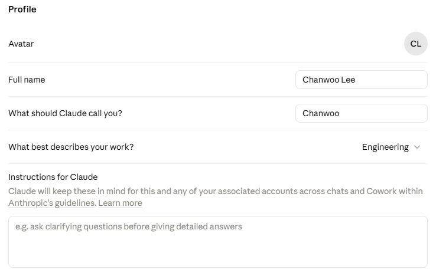
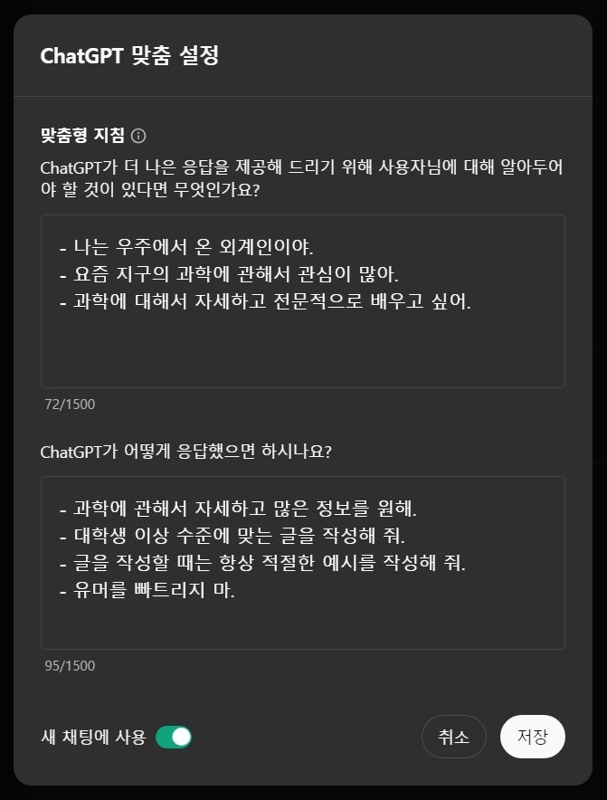
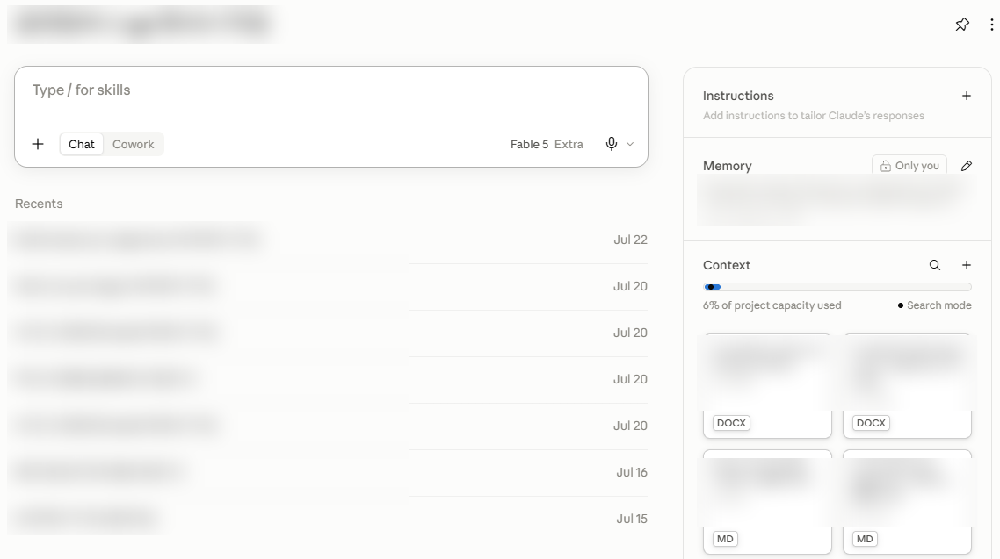

<!--
Part 1 슬라이드 초안 (12장, 40분 — 원 번호 #4~15 중 #9·#12 제외, #6→#6a/#6b, #10→#10a/#10b 분할)

- 인트로의 "IQ 150+ 후배" 프레임을 관통시킨 버전: 각 기능을 "후배에게 무엇을
  주는가"로 읽고, Introduction ②의 매핑을 해당 장에서 회수한다 —
  instructions(#6b→#10), memory(#10), tools(#8), MCP(#13), harness(#14),
  permissions·검증(#15, 상세는 Part 2 팀 설정). skills는 Part 2에서 완성.
- 이 파일은 Marp 소스이자 문안 초안이다. 문안 확정 후 테마·도식만 입힌다.
- 각 슬라이드의 HTML 주석은 Marp 프레젠터 노트로 렌더링된다 (스피커 노트 + 시간).
- [도식 자리], [시연 자리] 표시는 제작 단계에서 교체.
- 렌더: npx @marp-team/marp-cli slides/part1-draft.md --theme-set slides/themes/lab.css -o part1.pdf
-->

# 전체 조망 — 한 방향의 진화

**모든 기능은 후배에게 "더 많은 맥락을, 더 많은 행동 능력을" 주는 방향의 진화였다**

```
2023          2024                    2025                      2026
 채팅   →   컨텍스트/멀티모달   →   에이전트의 탄생        →   에이전트의 보편화
            도구/지식/표준           (Claude Code)              (Skills, SDK, Cowork,
            (Tool use, Projects,                                 Claude 5 세대)
             MCP)
```

[도식 자리: 위 텍스트 타임라인을 그래픽으로 — 연도 축 + 기능 아이콘 + 방향 화살표]

<!--
#4 | 2분
- "지금부터 40분간 이 타임라인을 왼쪽에서 오른쪽으로 걷습니다."
- 인트로의 후배 은유를 이어받는 장: "Introduction의 두 질문(무엇을 주고,
  어떻게 맡길까)에 업계가 3년간 내놓은 답이 이 타임라인입니다."
- 각 기능이 "왜 나왔는지"를 보면 언제 써야 하는지도 알게 된다는 프레임 제시.
- 여기서는 조망만, 세부는 다음 장부터. 뒤에서 이 그림이 다시 나온다고 예고.
-->

---

# Chatbot (2023)

<style scoped>
p:has(img) { text-align: center; margin: 2px 0; }
p:has(img) img { margin: 0 8px; vertical-align: top; }
em { display: block; text-align: center; font-size: 17px; margin: 2px 0 14px; }
</style>

 

*< 클로드와 GPT의 채팅 화면 >*

- 질문에 답하는 챗봇
- 한계
  - **갇힌 지식** - 학습된 지식뿐, 최신 정보를 모름
  - **수동 전달** - 모든 맥락을 매번 전달하고, 결과도 직접 받아 옮겨야 함
  - **환각** - 그럴듯한 오답을 자신 있게 말함
  - 이 한계들이 이후 등장할 기능들의 동기가 된다

<!--
#5 | 3분 | 사용자 직접 구성 버전 기반
- 우측: 클로드·GPT 실제 채팅 화면 캡처 (slides/assets/part1/).
- 2023.03 첫 Claude 공개(API), 2023.07 claude.ai 공개로 누구나 사용.
- 후배 은유 연결 멘트: "아는 것은 많은데 우리 일은 아무것도 모르는 후배의
  첫 출근과 같습니다."
- 마지막 문장이 Part 1 전체의 예고편. "갇힌 지식 → 도구가 풉니다.
  수동 전달 → 에이전트가 풉니다. 환각 → 끝까지 남는 문제라 검증 습관이
  필요합니다."
-->

---

# 챗봇 시대의 사용법 ① — 잘 묻기 (브리핑)

**나쁜 질문**
> "코드가 안 돌아가요. 고쳐주세요."

**좋은 질문**
> [상황] 주문 API에 페이지네이션 추가 중 / [자료] 에러 로그 + 해당 함수 첨부
> [제약] DB 스키마는 못 바꿈 / [요청] 원인 후보 2개와 각각의 수정안을 diff로

**공식: 맥락 + 자료 + 제약 + 원하는 출력 형태** — 사람 후배에게 하는 브리핑과 같다

<!--
#6a | 4분 (시연 3분 포함)
- [시연 자리] 두 질문을 실제로 던져 응답 차이를 보여준다 (part1-demos.md 시연 1).
- 시연 후: "차이는 모델 성능이 아니라 입력의 질입니다. 똑똑한 후배도
  브리핑 없이는 일을 못 합니다."
- 역량 ① 잘 묻기 — 이 발표에서 시대마다 "필요해진 역량"을 하나씩 짚겠다고 안내.
-->

---

# 챗봇 시대의 사용법 ② — Instructions

<style scoped>
p:has(img) { text-align: center; margin: 2px 0; }
p:has(img) img { margin: 0 10px; vertical-align: top; }
em { display: block; text-align: center; font-size: 17px; margin: 2px 0 12px; }
</style>

 

*< Claude와 GPT의 custom instruction >*

- **프롬프트 엔지니어링의 시대** — 채팅 지시와 함께 입력해주던 맥락, 규칙, 원하는 출력 형태
  - **"너는 10년 차 백엔드 엔지니어야"** — 역할(persona)을 부여하기도 함
- **Global instruction** — 매 대화마다 반복 입력하던 맥락을 별도로 관리, 모든 대화에 자동 적용
- **AI에게 노하우를 전달하는 초기 방법** — 이 계보가 Projects 지침 → CLAUDE.md → skills로 이어진다

<!--
#6b | 3분 | 사용자 원안 기반 (전체본 v2 문안) | 지시의 계보 부 축의 출발 정거장
- 캡처 2장: 왼쪽 Claude 프로필 개인 지침, 오른쪽 ChatGPT 맞춤 설정 (원안 보존본).
- 변화의 서사가 이 장의 핵심: "매번 채팅에 붙여넣던 역할·규칙 →
  설정에 한 번 담아두면(global instruction) 끝. 담는 곳이 생긴 것이
  instructions의 시작입니다."
- 담는 곳의 계보(스피커용 연표): 시스템 프롬프트(2023.11, API) →
  개인 지침(claude.ai 프로필, 계정 전역) → Projects 커스텀 지침(2024.06,
  프로젝트 단위) → CLAUDE.md → skills. 담는 곳이 곧 적용 범위.
- 후배 은유: 페르소나 = 후배에게 역할과 기준을 정해주는 것.
- Introduction ② 매핑 회수: **instructions**의 출발점이 여기.
- 복선: "반복하는 지시를 담아두려는 이 흐름, 기억해두세요 — Projects(#10),
  CLAUDE.md, 그리고 발표 후반부의 스킬까지 이어집니다."
-->

---

# 2023~24: 온보딩 자료를 통째로 건네다

**긴 컨텍스트** — 100K → 200K → 지금은 1M 토큰
로그·문서·코드를 쪼개지 말고 통째로. "요약"을 넘어 "이 로그에서 장애 원인 찾아줘"

**비전** (2024.03, Claude 3) — 말로 옮기지 말고 보여줘라
에러 스크린샷·아키텍처 다이어그램·UI 시안 그대로 붙여넣기

**역량 ②③** — 무엇을 골라 넣을지(큐레이션), 글로 줄지 그림으로 줄지 판단

<!--
#7 | 3분 | 간단히 훑는 장
- 두 기능 모두 "입력의 확장"이라는 하나의 이야기로 묶어 짧게.
- 백업 캡처 2장(로그 원인 분석, 다이어그램 병목 분석)을 띄우는 것으로 시연 대체.
  시간 여유 시에만 로그 시연(part1-demos.md 시연 2)을 라이브로.
- 큐레이션 한 줄 교정: "많이 넣을수록 좋다" ✗ — 무관한 자료는 초점을 흐린다.
-->

---

# 2024.05: 후배에게 도구를 쥐여주다 — Tool use

**문제: 모델은 말만 할 수 있었다 — 검색·계산·조회를 전부 사람이 대신 하고, 결과를 손으로 붙여넣었다**

```
Before — 사람이 중계기 (#5의 갇힌 지식 + 수동 전달)
  요청 → 모델: "~를 검색/실행해 보세요" → 사람이 실행 → 결과 붙여넣기 → 다시 모델

After — 모델이 도구를 골라 쓴다 (Tool use)
  요청 → 모델이 도구 선택 → 실행 → 결과 관찰 → 다음 판단
          (웹 검색, 코드 실행, 조회, ...)
```

- **갇힌 지식이 열린다** — 웹 검색으로 최신 정보, 코드 실행으로 정확한 계산·차트
- **수동 전달이 줄어든다** — 사람의 중계 없이 모델이 결과까지 확인 (완전 해소는 에이전트, #14)
- **에이전트로 가는 첫 단추** — "도구를 골라 쓰는 모델", Introduction ②의 tools가 여기서 시작

**역량 ④ 능력 범위 파악** — 지금 모델이 할 수 있는 일과 없는 일을 아는 것

<!--
#8 | 3분 | 서사: 무슨 문제를 풀려고 나왔나
- 서사 순서: ① #5의 두 한계(갇힌 지식·수동 전달)를 다시 소환 → ② 그동안은
  사람이 검색·실행을 대신 하는 중계기였다 → ③ 모델이 도구를 "골라 쓰게"
  허용한 것이 Tool use (2024.05 GA).
- 개발자용 정확한 한 줄(말로): 실행 주체는 앱/클라이언트 쪽 — 모델은 도구
  "요청"과 결과 "판단"을 맡는다. 그래서 무엇을 열어줄지는 우리가 정한다(#13·#15 복선).
- [도식 자리] After 줄을 루프 도식으로 (요청→선택→실행→관찰이 도는 그림).
  이 도식이 #14에서 "스스로 도는 루프"로 확장된다 — 같은 시각 언어 유지.
- 개발자 관점 한 줄: 도구 설명을 잘 쓰는 것 = API 문서를 잘 쓰는 것.
- "첫 단추" 표현으로 수렴(#14) 복선.
-->

---

# 2024.06: Projects — 후배에게 도메인 지식을 주는 법

<style scoped>
p:has(img) { text-align: center; margin: 0; }
em { display: block; text-align: center; font-size: 17px; margin: 2px 0 8px; }
table { font-size: 20px; }
</style>



*< 실제 프로젝트 화면 — Instructions · Memory · Context >*

**지침·지식·기억을 한 번 담아두면, 그 안의 모든 대화가 공유하는 업무 공간** — 작업의 맥락을 주제별로 분리해 관리

| 요소 | 역할 |
|------|------|
| **Instructions** | 프로젝트의 모든 대화에 적용되는 규칙 |
| **Context** | 프로젝트의 공용 참조 지식 (설계 문서, 가이드, 용어집 등) |
| **Conversations** | 프로젝트 내 채팅은 서로 참조 가능 — 흩어지지 않는 히스토리 |
| **Project memory** | 자동으로 관리되는 프로젝트 내부 메모리 |

<!--
#10a | 3분 | 사용자 원안 기반 (실제 프로젝트 화면 캡처) | Projects 3장의 시작
- 도입 멘트(인트로 회수): "Introduction에서 '내가 아직 나은 점 = 도메인 지식·
  노하우'라고 했죠. 그걸 후배에게 넘겨주는 첫 번째 기능입니다."
- 요소 명칭은 실제 UI 라벨을 따름: Instructions / Context(구 지식 베이스,
  Knowledge) / Project memory — 캡처 화면의 패널명과 1:1 대응.
- 캡처 포인트 짚기: 오른쪽 패널에 Instructions·Memory·Context가 다 보임.
  Context의 "6% of project capacity used · Search mode" 표시 → 다음 장(#10b)
  동작 원리 이야기의 자연스러운 예고.
- 왜 지금도 중요한가(말로): 에이전트 시대에도 설계 논의·문서 작성·리뷰 상담은
  여전히 채팅 — Projects가 그 채팅에 팀의 맥락을 깔아준다.
- 부 축 상기: #6b instructions의 다음 정거장 (계정 전역 → 프로젝트 단위).
- Introduction ② 매핑 회수: Instructions = **instructions**, Context +
  Project memory = **memory**.
- ⚠️ 지침 분량(약 8천 자) 등 수치는 발표 전 헬프센터 재확인.
-->

---

# Projects — 지식 베이스는 어떻게 동작하나

**작으면 전부 읽고, 크면 검색한다**

```
지식 베이스 크기 ≤ 컨텍스트 창   →  통째로 로드 (모든 대화가 전체를 봄)
지식 베이스 크기 > 컨텍스트 창   →  RAG 검색 모드 자동 전환 (유료 플랜)
                                    질문과 관련된 부분만 찾아서 로드
```

- 개발자 관점: 그래도 **큐레이션이 중요** — 검색 모드에서도 잡음 문서는 답의 품질을 낮춘다

**제공 범위** (2026.08 기준, 발표 전 재확인)

- Free: 프로젝트 5개 (2026.02~) / **Pro·Max·Team·Enterprise**: 무제한 + RAG 모드
- **팀 공유**: Team·Enterprise — 역할 기반(비공개/보기/편집), 지침·지식 공동 관리

<!--
#10b | 3분 | 동작 원리와 제공 범위 — 개발자 청중용 심화
- "작으면 전부, 크면 검색" 한 줄이 이 장의 전부. 컨텍스트 창이 유한한 자원이라는
  발표 후반(#20 정적/동적 로딩) 이야기의 복선이기도 하다.
- 팀 공유: "개인 프로젝트로 시작해서, 잘 만든 것을 팀 프로젝트로 승격"이 실전 경로.
- ⚠️ 수치·플랜 조건(Free 5개, RAG 제공 플랜, 공유 역할)은 변동 가능 —
  발표 직전 support.claude.com 헬프센터에서 재확인 후 확정.
-->

---

# Projects 실전 — 세 가지 패턴

**① 팀 컨벤션 가이드** — API 설계·코드 리뷰 규칙을 지침으로
→ 모든 설계 상담에 팀 규칙이 자동 반영

**② 온보딩·도메인 지식** — 설계 문서·용어집·아키텍처 개요를 지식으로
→ "이 시스템에서 X는 어떻게 동작해?"를 신입도 바로

**③ 반복 업무 템플릿** — 장애 회고, 릴리즈 노트, 주간 보고
→ 형식·톤을 지침에 담아 매번 같은 품질로

**잘 쓰는 팁**: 지침은 짧고 명령형으로 (한도가 커도 짧을수록 잘 지켜진다)
/ 문서는 선별해서 — 검색 모드에서도 잡음이 품질을 낮춘다 (큐레이션 ②)
/ 프로젝트 단위 = 업무 단위 (전부 담은 하나 ✗, 목적별 여러 개 ✓)
/ 잘 만든 개인 프로젝트는 팀 프로젝트로 승격

<!--
#11 | 6분 (미니 시연 3분 포함)
- [시연 자리] 시연 5 (확대판): 지침이 담긴 프로젝트 안/밖에서 같은 설계 질문
  → 응답 차이 확인 → 이어서 지식 문서 기반 질문 1개 (part1-demos.md 참고).
- 시연 후: "같은 질문, 다른 답. 차이는 담아둔 지침과 문서뿐입니다."
- 역량 ⑥ 지식의 문서화 — 문서화 잘하는 팀이 AI도 잘 쓰는 팀.
- Part 2 복선: "이 지침이 코드 레포로 들어간 것이 잠시 후 볼 CLAUDE.md입니다."
-->

---

# 2024.11: MCP — 연결의 표준화

**문제: 도구는 쓸 수 있게 됐는데, 연결은 전부 수제였다 — 앱 M개 × 도구 N개 = M×N번의 커스텀 통합**

```
Before (M×N) — 앱·도구 조합마다 전용 커넥터를 따로 개발
  [Claude]═[위키]  [Claude]═[DB]  [IDE]═[위키]  [IDE]═[DB]  [챗봇]═[위키] ...

After (M+N) — 연결 규격은 MCP 하나
  [사내 위키]   [이슈 트래커]   [사내 DB]
       └──────── MCP 서버 ────────┘
                    │ (표준 프로토콜)
       ┌────────────┼────────────┐
  [Claude.ai]  [Claude Code]  [다른 클라이언트]
```

- 도구 쪽은 **MCP 서버** 한 번, 앱 쪽은 **MCP 클라이언트** 한 번만 구현 — 조합 폭발이 사라진다
- "AI계의 USB-C" — 기기마다 다른 케이블 대신 포트 하나
- Anthropic이 공개한 오픈 표준(2024.11) → 업계 전반 채택 — 사내 시스템을 여는 공용 열쇠

**역량 ⑧ 통합 설계** — 무엇을 어떤 경계로 열지 결정하는 안목 (권한 제한은 선배의 일)

<!--
#13 | 3분 | 서사: 무슨 문제를 풀려고 나왔나
- 서사 순서: ① #8에서 도구 사용이 열림 → ② 그런데 연결마다 다른 API·인증·
  형식을 앱별로 따로 구현 (통합 M×N 조합 폭발) → ③ 그래서 연결 "규격"을
  공개 표준으로 — 도구는 서버 한 번, 앱은 클라이언트 한 번 (M+N).
- Introduction ② 매핑 회수: 후배에게 서버·사내 시스템 접근을 주는 방법 =
  **MCP**. "서버 할당"의 표준화.
- 채택 언급(스피커): OpenAI(2025.03)·Google 등도 클라이언트로 채택
  ⚠️ 발표 전 최신 상태 재확인.
- [도식 자리] Before/After 텍스트 도식을 그래픽으로.
- 개념 소개까지만. "실제로 어떻게 붙이는지는 Part 2에서 Claude Code와 함께."
- 보안 경계 언급: 열어주는 만큼 접근 범위를 설계해야 한다 (#15와 연결).
-->

---

# 2025: 수렴 — 일을 통째로 맡길 수 있는 후배

**모든 조각이 조립되어, 스스로 루프를 도는 모델(에이전트)이 되다**

```
긴 컨텍스트 ─┐
비전        ─┤     스스로 계획하고, 도구를 쓰고,
도구 사용    ─┼─→  결과를 확인하며 루프를 도는 모델   =  에이전트
지식/지침    ─┤     (extended thinking, 2025.02)        (이 루프를 감싼 틀이
MCP        ─┘                                          곧 harness)
```

**2025.02 — 그 조립의 결과물이 등장한다: Claude Code**

<!--
#14 | 5분 | Part 1의 클라이맥스
- [도식 자리] 조각들이 하나로 합쳐지는 조립 도식. #8의 루프 도식이 확장된
  형태로 그려 시각적 연속성 유지. 이 도식은 Part 2 #16에서 재등장한다.
- "새 발명품이 아니라 여러분이 방금 본 기능들의 조립입니다" — 발표 전체의
  중심 문장. 여기서 호흡을 길게.
- Introduction ② 매핑 완성: 루프를 감싸 도구·권한·컨텍스트를 관리하는 틀이
  **harness** — 이로써 tools·MCP·harness 줄이 모두 채워졌다.
  (instructions·memory·skills 줄은 Projects~Part 2 CLAUDE.md·스킬에서 완성)
- extended thinking(깊은 추론)이 마지막 조각이었다는 서사.
-->

---

# 후배가 아무리 똑똑해도, 검증은 선배의 일

**Part 2로 넘어가기 전에 — 두 가지 안전 수칙 (Introduction ②의 "permissions·업무의 검증")**

1. **환각은 사라지지 않았다** → 결과는 반드시 검증한다
   (테스트 실행, 코드 리뷰, 출처 확인 — 능력이 커질수록 검증도 커져야)
2. **보안 경계를 확인한다** → 권한은 필요한 만큼만, 사내 코드·데이터 반출 기준 준수
   (⚠️ 사내 정책 확인 후 이 장 문안 확정)

> 도구는 강해졌고, 책임은 여전히 우리에게 있다.

<!--
#15 | 2분
- Introduction ②의 "업무의 검증"·"권한 제한"이 여기서 안전 수칙으로 회수됨 —
  후배 은유로: 일을 맡겨도 최종 책임과 검증은 선배(우리)의 몫.
- 사내 보안 정책(허용된 플랜/계정, 코드 반출 기준) 확인 후 문안 확정 필요.
- 휴식 직전 장이므로 "10분 쉬고, 방금 본 조립의 결과물을 직접 봅니다"로
  Part 2 기대감 조성하며 마무리.
-->
