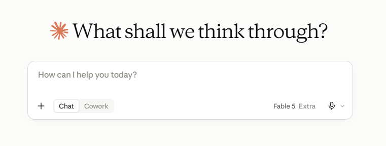
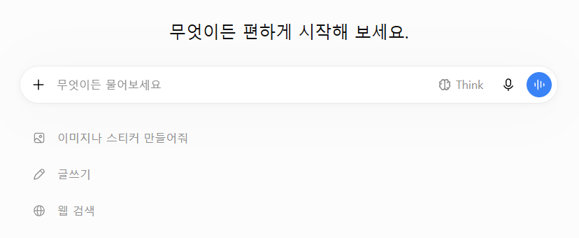

<!--
Part 1 슬라이드 초안 (#4~15, 40분)

- 인트로의 "IQ 150+ 후배" 프레임을 관통시킨 버전: 각 기능을 "후배에게 무엇을
  주는가"로 읽고, Introduction ②의 매핑을 해당 장에서 회수한다 —
  instructions(#6→#10), memory(#10), tools(#8), MCP(#13), harness(#14),
  permissions·검증(#15, 상세는 Part 2 팀 설정). skills는 Part 2에서 완성.
- 이 파일은 Marp 소스이자 문안 초안이다. 문안 확정 후 테마·도식만 입힌다.
- 각 슬라이드의 HTML 주석은 Marp 프레젠터 노트로 렌더링된다 (스피커 노트 + 시간).
- [도식 자리], [시연 자리] 표시는 제작 단계에서 교체.
- 렌더: npx @marp-team/marp-cli slides/part1-draft.md --theme-set slides/themes/lab.css -o part1.pdf
-->

# 전체 조망 — 한 방향의 진화

**모든 기능은 후배에게 "더 많은 맥락을, 더 많은 행동 능력을" 주는 방향의 진화였다**

```
2023          2024                    2025                      2026
 채팅   →   컨텍스트/멀티모달   →   에이전트의 탄생        →   에이전트의 보편화
            도구/산출물/표준         (Claude Code)              (Skills, SDK, Cowork,
            (Tool use, Artifacts,                                Claude 5 세대)
             Projects, MCP)
```

[도식 자리: 위 텍스트 타임라인을 그래픽으로 — 연도 축 + 기능 아이콘 + 방향 화살표]

<!--
#4 | 2분
- "지금부터 40분간 이 타임라인을 왼쪽에서 오른쪽으로 걷습니다."
- 인트로의 후배 은유를 이어받는 장: "Introduction의 두 질문(무엇을 주고,
  어떻게 맡길까)에 업계가 3년간 내놓은 답이 이 타임라인입니다."
- 각 기능이 "왜 나왔는지"를 보면 언제 써야 하는지도 알게 된다는 프레임 제시.
- 여기서는 조망만, 세부는 다음 장부터. 뒤에서 이 그림이 다시 나온다고 예고.
-->

---

# Chatbot (2023)

<style scoped>
p:has(img) { text-align: center; margin: 2px 0; }
p:has(img) img { margin: 0 8px; vertical-align: top; }
em { display: block; text-align: center; font-size: 17px; margin: 2px 0 14px; }
</style>

 

*< 클로드와 GPT의 채팅 화면 >*

- 질문에 답하는 챗봇
- 한계
  - **갇힌 지식** - 학습된 지식뿐, 최신 정보를 모름
  - **수동 전달** - 모든 맥락을 매번 전달하고, 결과도 직접 받아 옮겨야 함
  - **환각** - 그럴듯한 오답을 자신 있게 말함
  - 이 한계들이 이후 등장할 기능들의 동기가 된다

<!--
#5 | 3분 | 사용자 직접 구성 버전 기반
- 우측: 클로드·GPT 실제 채팅 화면 캡처 (slides/assets/part1/).
- 2023.03 첫 Claude 공개(API), 2023.07 claude.ai 공개로 누구나 사용.
- 후배 은유 연결 멘트: "아는 것은 많은데 우리 일은 아무것도 모르는 후배의
  첫 출근과 같습니다."
- 마지막 문장이 Part 1 전체의 예고편. "갇힌 지식 → 도구가 풉니다.
  수동 전달 → 산출물·에이전트가 풉니다. 환각 → 끝까지 남는 문제라 검증 습관이
  필요합니다."
-->

---

# 기본기 — 후배에게 일을 잘 설명하는 법

**나쁜 질문**
> "코드가 안 돌아가요. 고쳐주세요."

**좋은 질문**
> [상황] 주문 API에 페이지네이션 추가 중 / [자료] 에러 로그 + 해당 함수 첨부
> [제약] DB 스키마는 못 바꿈 / [요청] 원인 후보 2개와 각각의 수정안을 diff로

**공식: 맥락 + 자료 + 제약 + 원하는 출력 형태** — 사람 후배에게 하는 브리핑과 같다

<!--
#6 | 6분 (시연 3분 포함)
- [시연 자리] 두 질문을 실제로 던져 응답 차이를 보여준다 (part1-demos.md 시연 1).
- 시연 후: "차이는 모델 성능이 아니라 입력의 질입니다. 똑똑한 후배도
  브리핑 없이는 일을 못 합니다."
- 역량 ① 잘 묻기 — 이 발표에서 시대마다 "필요해진 역량"을 하나씩 짚겠다고 안내.
- 시스템 프롬프트(2023.11, Claude 2.1): 매번 반복하던 역할·규칙을 대화에서
  분리해 고정한 첫걸음 — Introduction ②에서 본 **instructions**의 출발점.
  **복선**: "반복하는 지시를 담아두려는 이 흐름, 기억해두세요.
  오늘 발표 후반부(스킬)까지 이어집니다."
-->

---

# 2023~24: 온보딩 자료를 통째로 건네다

**긴 컨텍스트** — 100K → 200K → 지금은 1M 토큰
로그·문서·코드를 쪼개지 말고 통째로. "요약"을 넘어 "이 로그에서 장애 원인 찾아줘"

**비전** (2024.03, Claude 3) — 말로 옮기지 말고 보여줘라
에러 스크린샷·아키텍처 다이어그램·UI 시안 그대로 붙여넣기

**역량 ②③** — 무엇을 골라 넣을지(큐레이션), 글로 줄지 그림으로 줄지 판단

<!--
#7 | 3분 | 간단히 훑는 장
- 두 기능 모두 "입력의 확장"이라는 하나의 이야기로 묶어 짧게.
- 백업 캡처 2장(로그 원인 분석, 다이어그램 병목 분석)을 띄우는 것으로 시연 대체.
  시간 여유 시에만 로그 시연(part1-demos.md 시연 2)을 라이브로.
- 큐레이션 한 줄 교정: "많이 넣을수록 좋다" ✗ — 무관한 자료는 초점을 흐린다.
-->

---

# 2024.05: 후배에게 도구를 쥐여주다 — Tool use

**모델이 학습 지식 밖의 세계와 상호작용하기 시작 — Introduction ②의 "tools"가 여기서 시작된다**

```
사용자 요청 → 모델이 도구 선택 → 실행 → 결과를 보고 다음 판단
              (검색, 계산, 조회, ...)
```

- 웹 검색(최신 정보), 코드 실행(정확한 계산·차트) — 갇힌 지식의 벽이 열림
- **에이전트로 가는 첫 단추**: "도구를 골라 쓰는 모델"

**역량 ④ 능력 범위 파악** — 지금 모델이 할 수 있는 일과 없는 일을 아는 것

<!--
#8 | 3분
- [도식 자리] 위 코드 블록을 루프 도식으로 (요청→선택→실행→관찰이 도는 그림).
  이 도식이 #14에서 "스스로 도는 루프"로 확장된다 — 같은 시각 언어 유지.
- 개발자 관점 한 줄: 도구 설명을 잘 쓰는 것 = API 문서를 잘 쓰는 것.
- "첫 단추" 표현으로 수렴(#14) 복선.
-->

---

# 2024.06: 후배가 결과물로 보고하다 — Artifacts

**대화가 아니라 작업물을 받는다**

- 코드·문서·**실행되는 HTML 프로토타입**이 별도 창에 — 반복 수정·공유 가능
- "설명해줘" ✗ → "이런 산출물을 만들어줘" ✓ (역량 ⑤)

[캡처 자리: API 명세 → 동작하는 목업 페이지가 뜬 화면 1장]

<!--
#9 | 2분 | 간단히 언급하는 장
- 라이브 생성 대신 사전 준비한 30초 녹화(또는 캡처 2장: 생성 직후 + 필터 탭
  추가 후)로 빠르게. part1-demos.md 시연 4(축소판) 참고.
- "수동 전달의 벽(#5)이 절반 열린 지점" 한 줄로 연결하고 다음 장으로.
-->

---

# 2024.06: Projects — 후배에게 도메인 지식을 주는 법

**Introduction의 질문 "내가 나은 점 = 도메인 지식·노하우" — 그걸 넘겨주는 첫 번째 기능**

구성은 세 가지:

| 요소 | 역할 |
|------|------|
| **커스텀 지침** | 이 프로젝트의 모든 대화에 적용되는 규칙 ("우리 팀 컨벤션을 반영해라") |
| **지식 문서** | 업로드해둔 문서를 모든 대화가 참조 (설계 문서, 가이드, 용어집) |
| **대화 모음** | 같은 업무의 대화가 한곳에 — 흩어지지 않는 히스토리 |

**왜 지금도 중요한가**: 에이전트 시대에도 설계 논의·문서 작성·리뷰 상담은
여전히 채팅에서 — Projects는 그 채팅에 **팀의 맥락**을 깔아주는 기반

<!--
#10 | 5분 | Part 1의 두 번째 하이라이트 시작
- "잠깐 쓰고 지나간 기능이 아니라, 채팅 시대부터 지금까지 계속 중요한 기능"
  이라는 프레임 — 이 장과 다음 장에 10분을 쓰는 이유를 청중에게 설명.
- 부 축 상기: #6 시스템 프롬프트(개발자 API 기능)가 일반 사용자 기능이 된
  두 번째 정거장. "반복하는 지시를 담아두는 흐름이 진화하고 있습니다."
- Introduction ② 매핑 회수: 커스텀 지침 = **instructions**, 지식 문서 +
  이후의 Memory = **memory**. "후배에게 도메인 지식을 주는 법의 1세대입니다."
- 세 요소를 하나씩 실제 화면 캡처와 함께. 이후 Memory(대화 간 자동 기억)로
  확장됐다는 한 줄.
-->

---

# Projects 실전 — 세 가지 패턴

**① 팀 컨벤션 가이드** — API 설계·코드 리뷰 규칙을 지침으로
→ 모든 설계 상담에 팀 규칙이 자동 반영

**② 온보딩·도메인 지식** — 설계 문서·용어집·아키텍처 개요를 지식으로
→ "이 시스템에서 X는 어떻게 동작해?"를 신입도 바로

**③ 반복 업무 템플릿** — 장애 회고, 릴리즈 노트, 주간 보고
→ 형식·톤을 지침에 담아 매번 같은 품질로

**잘 쓰는 팁**: 지침은 짧고 명령형으로 / 문서는 선별해서 (큐레이션 ②)
/ 프로젝트 단위 = 업무 단위 (전부 담은 하나 ✗, 목적별 여러 개 ✓)

<!--
#11 | 5분 (미니 시연 3분 포함)
- [시연 자리] 시연 5 (확대판): 지침이 담긴 프로젝트 안/밖에서 같은 설계 질문
  → 응답 차이 확인 → 이어서 지식 문서 기반 질문 1개 (part1-demos.md 참고).
- 시연 후: "같은 질문, 다른 답. 차이는 담아둔 지침과 문서뿐입니다."
- 역량 ⑥ 지식의 문서화 — 문서화 잘하는 팀이 AI도 잘 쓰는 팀.
- Part 2 복선: "이 지침이 코드 레포로 들어간 것이 잠시 후 볼 CLAUDE.md입니다."
-->

---

# 2024.10: 처음으로 맡기고 지켜보다 — Computer use

**"매 단계 지시"에서 "맡기고 지켜보기"로 — 후배에게 일을 통째로 맡기는 첫 실험**

- 모델이 화면을 보고, 판단하고, 커서를 움직여 사람처럼 조작 (베타)
- 성숙한 제품이라기보다 **방향을 보여준 실험** — 에이전트 예고편

**역량 ⑦ 위임 범위 판단** — 맡길 일과 직접 할 일을 구분하는 감각

<!--
#12 | 2분
- 데모 영상 캡처 1장이면 충분. 짧게 치고 넘어가는 장.
- "이 실험이 왜 중요했는가": 도구를 '골라 쓰는' 것을 넘어 '연속으로,
  스스로' 쓰는 모델의 가능성을 보여줌. #14 수렴의 두 번째 복선.
-->

---

# 2024.11: 사내 시스템 열쇠를 주는 표준 — MCP

**후배에게 서버·사내 시스템 접근을 주는 방법이 하나의 공개 표준이 되다 (Introduction ②의 "MCP")**

```
[사내 위키]  [이슈 트래커]  [사내 DB]
     └──────── MCP 서버 ────────┘
                  │ (표준 프로토콜)
     ┌────────────┼────────────┐
 [Claude.ai]  [Claude Code]  [다른 클라이언트]
```

- 한 번 만들면 어디서나: MCP 서버 하나로 모든 MCP 클라이언트에서 사용
- 업계 전반이 채택한 오픈 표준

**역량 ⑧ 통합 설계** — 무엇을 어떤 경계로 열지 결정하는 안목 (권한 제한은 선배의 일)

<!--
#13 | 3분
- [도식 자리] 위 텍스트 도식을 그래픽으로.
- 개념 소개까지만. "실제로 어떻게 붙이는지는 Part 2에서 Claude Code와 함께."
- 보안 경계 언급: 열어주는 만큼 접근 범위를 설계해야 한다 (#15와 연결).
-->

---

# 2025: 수렴 — 일을 통째로 맡길 수 있는 후배

**모든 조각이 조립되어, 스스로 루프를 도는 모델(에이전트)이 되다**

```
긴 컨텍스트 ─┐
비전        ─┤
도구 사용    ─┼─→  스스로 계획하고, 도구를 쓰고,     =  에이전트
산출물      ─┤     결과를 확인하며 루프를 도는 모델      (이 루프를 감싼 틀이
지식/지침    ─┤     (extended thinking, 2025.02)         곧 harness)
MCP        ─┘
```

**2025.02 — 그 조립의 결과물이 등장한다: Claude Code**

<!--
#14 | 4분 | Part 1의 클라이맥스
- [도식 자리] 조각들이 하나로 합쳐지는 조립 도식. #8의 루프 도식이 확장된
  형태로 그려 시각적 연속성 유지. 이 도식은 Part 2 #16에서 재등장한다.
- "새 발명품이 아니라 여러분이 방금 본 기능들의 조립입니다" — 발표 전체의
  중심 문장. 여기서 호흡을 길게.
- Introduction ② 매핑 완성: 루프를 감싸 도구·권한·컨텍스트를 관리하는 틀이
  **harness** — 이로써 tools·MCP·harness 줄이 모두 채워졌다.
  (instructions·memory·skills 줄은 Projects~Part 2 CLAUDE.md·스킬에서 완성)
- extended thinking(깊은 추론)이 마지막 조각이었다는 서사.
-->

---

# 후배가 아무리 똑똑해도, 검증은 선배의 일

**Part 2로 넘어가기 전에 — 두 가지 안전 수칙 (Introduction ②의 "permissions·업무의 검증")**

1. **환각은 사라지지 않았다** → 결과는 반드시 검증한다
   (테스트 실행, 코드 리뷰, 출처 확인 — 능력이 커질수록 검증도 커져야)
2. **보안 경계를 확인한다** → 권한은 필요한 만큼만, 사내 코드·데이터 반출 기준 준수
   (⚠️ 사내 정책 확인 후 이 장 문안 확정)

> 도구는 강해졌고, 책임은 여전히 우리에게 있다.

<!--
#15 | 2분
- Introduction ②의 "업무의 검증"·"권한 제한"이 여기서 안전 수칙으로 회수됨 —
  후배 은유로: 일을 맡겨도 최종 책임과 검증은 선배(우리)의 몫.
- 사내 보안 정책(허용된 플랜/계정, 코드 반출 기준) 확인 후 문안 확정 필요.
- 휴식 직전 장이므로 "10분 쉬고, 방금 본 조립의 결과물을 직접 봅니다"로
  Part 2 기대감 조성하며 마무리.
-->
